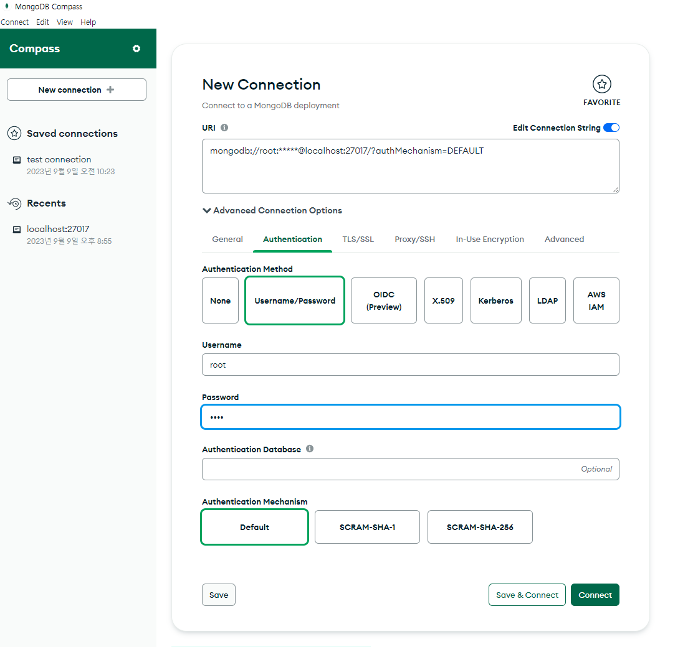
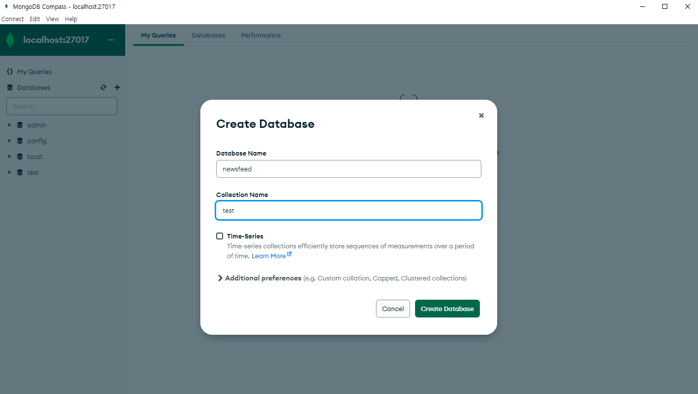
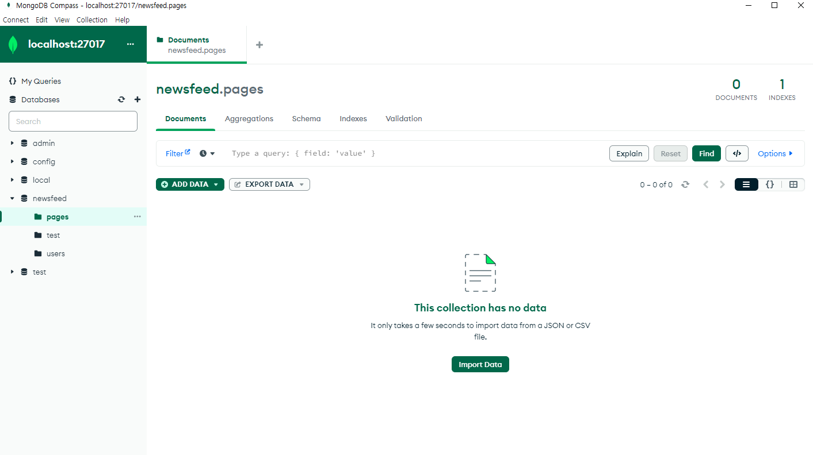
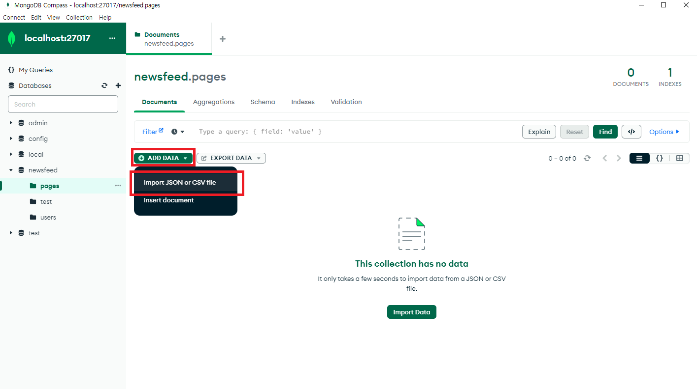
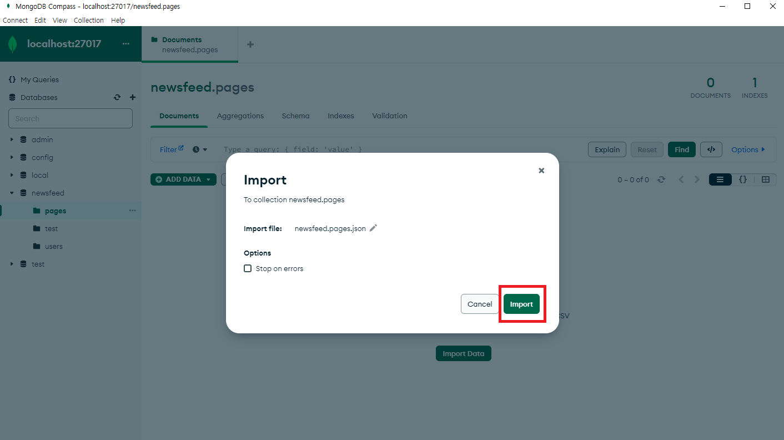
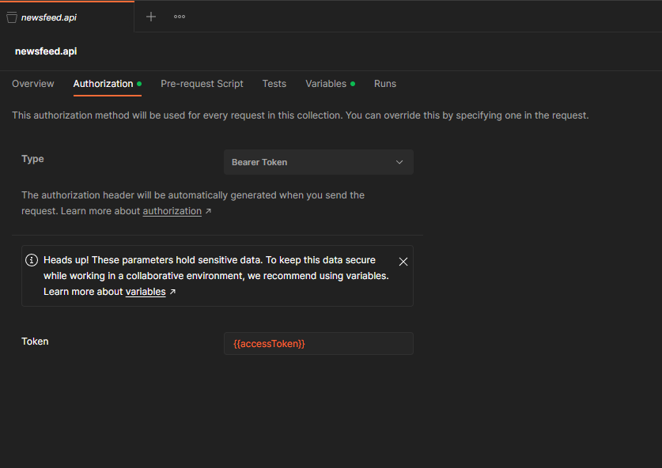
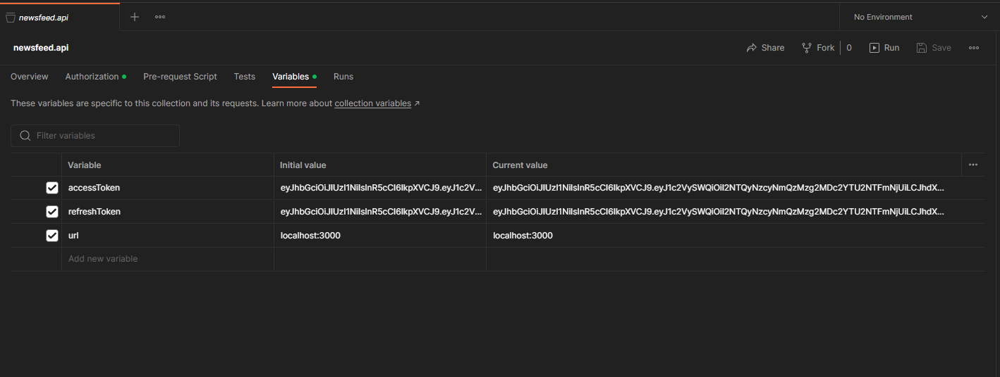
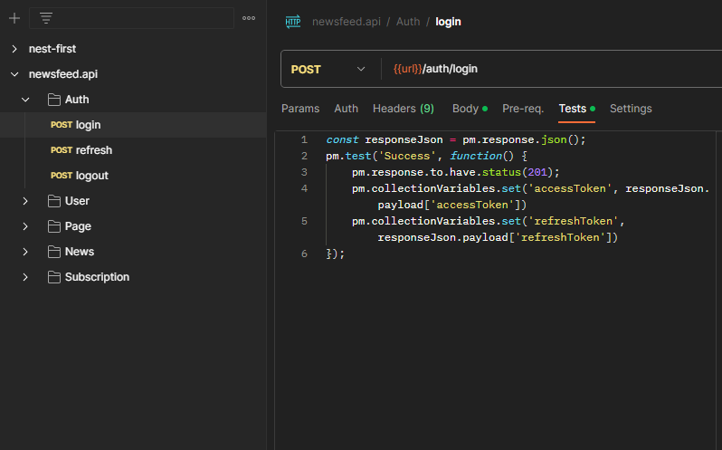

# newsfeed.api@1.0.0

nestjs 와 mongoose 기반으로 구성된 REST API 프로젝트입니다. 학교페이지를 생성하고 이를 구독하여 소식을 받아볼 수 있습니다. 기본에 충실하기 위해 노력했습니다. 아래 라이브러리를 기반으로 한 프로젝트를 구성하고 싶다면 이 프로젝트를 boilerplate 로 사용하셔도 됩니다.

```
"dependencies": {
    "@nestjs/common": "^8.0.0",
    "@nestjs/config": "^3.1.1",
    "@nestjs/core": "^8.0.0",
    "@nestjs/jwt": "^10.1.1",
    "@nestjs/mongoose": "^10.0.1",
    "@nestjs/passport": "^10.0.2",
    "@nestjs/platform-express": "^8.0.0",
    "@types/passport-jwt": "^3.0.12",
    "bcrypt": "^5.1.1",
    "class-transformer": "^0.5.1",
    "class-validator": "^0.14.0",
    "cookie-parser": "^1.4.6",
    "mongoose": "^7.0.0",
    "passport-jwt": "^4.0.1",
    "reflect-metadata": "^0.1.13",
    "rimraf": "^3.0.2",
    "rxjs": "^7.2.0"
  },
  "devDependencies": {
    "@nestjs/cli": "^8.0.0",
    "@nestjs/schematics": "^8.0.0",
    "@nestjs/testing": "^8.0.0",
    "@types/express": "^4.17.13",
    "@types/jest": "27.5.0",
    "@types/node": "^16.0.0",
    "@types/supertest": "^2.0.11",
    "@typescript-eslint/eslint-plugin": "^5.0.0",
    "@typescript-eslint/parser": "^5.0.0",
    "eslint": "^8.0.1",
    "eslint-config-prettier": "^8.3.0",
    "eslint-plugin-prettier": "^4.0.0",
    "jest": "28.0.3",
    "prettier": "^2.3.2",
    "source-map-support": "^0.5.20",
    "supertest": "^6.1.3",
    "ts-jest": "28.0.1",
    "ts-loader": "^9.2.3",
    "ts-node": "^10.0.0",
    "tsconfig-paths": "4.0.0",
    "typescript": "^4.3.5"
  },
```

## 0. API 문서
- link: [newsfeed.api open3.0](https://mmmmicha.github.io/newsfeed.api/docs/index.html)

## 1. 구동 방법
### 1.1 MongoDB
1. mongoDB image 를 docker 를 통해 내려받습니다.
    ```
    docker pull mongo
    ```
    - *version: v24.0.6*
2. 내려받은 mongoDB 이미지를 구동합니다.
    ```
    docker run --name mongodb -p 27017:27017 -e MONGO_INITDB_ROOT_USERNAME=root -e MONGO_INITDB_ROOT_PASSWORD=1234 -d mongo
    ```
    - 편의상 username(root)과 password(1234)를 간편하게 설정했습니다.
3. mongoDB 접근을 쉽게 하기 위해 edit tool 인 mongoDB compass 를 다운받습니다.
https://www.mongodb.com/try/download/compass
4. 아래 사진과 같은 셋팅으로 커넥션을 맺습니다.
  <br/>
  
5. 커넥션을 성공적으로 맺은 후 아래 사진과 같이 database 를 생성하고 collection 역시 생성합니다.(test collection 은 추후 삭제해도 무관합니다.)
  <br/>
  
6. mongoDB 에 대한 준비는 끝났습니다. 추후 nest server 를 run 하게되면 mongoose 라이브러리를 통해 nest server 에 명시해뒀던 model schema 가 mongoDB 내 collection 으로 auto creating 이 됩니다.
7. 추후 빈 schema 동기화가 완료된 상태에서 필요시엔 ```./mongodb```경로에 있는 테스트 데이터를 import 하세요.
    - 절차
      1. 아래와 같이 빈 스키마를 확인합니다. 
        <br/>
        
      2. 아래와 같이 ADD DATA 를 클릭합니다.
        <br/>
        
      3. mongodb 디렉토리 안에 있는 알맞은 schema 의 json 파일을 첨부합니다.
      4. 아래와 같이 import 를 클릭합니다.
        <br/>
        
### 1.2 newsfeed.api
1. nodejs 를 설치합니다.
  - *version: v18.18.2*
2. nestjs 를 설치합니다.
    ```
    npm i @nestjs/cli -g
    ```
    - *version: v10.2.1*
3. npm module 을 설치합니다.
    ```
    npm i
    ```
4. 어플리케이션을 테스트합니다.
    ```
    npm run test src
    ```
    - src 아래 모든 spec.ts 파일을 테스트 합니다.
5. 어플리케이션을 실행합니다.
    ```
    npm run start
    ```

### 1.3 Postman
- ```newsfeed.api.postman_collection.json```파일은 ```./postman```경로에 있습니다.
- 환경설정은 아래와 같이 No Environment 에 Parents Environment 를 사용하는 것을
원칙으로 합니다.
  - authorization
    <br/>
    
  - variable
    <br/>
    
- ```Auth``` 폴더 내 'login', 'refresh', 'logout' 엔 아래와 같이 ```Tests``` 가 작성되어있어 편리한 테스트가 가능합니다.
  <br/>
  
